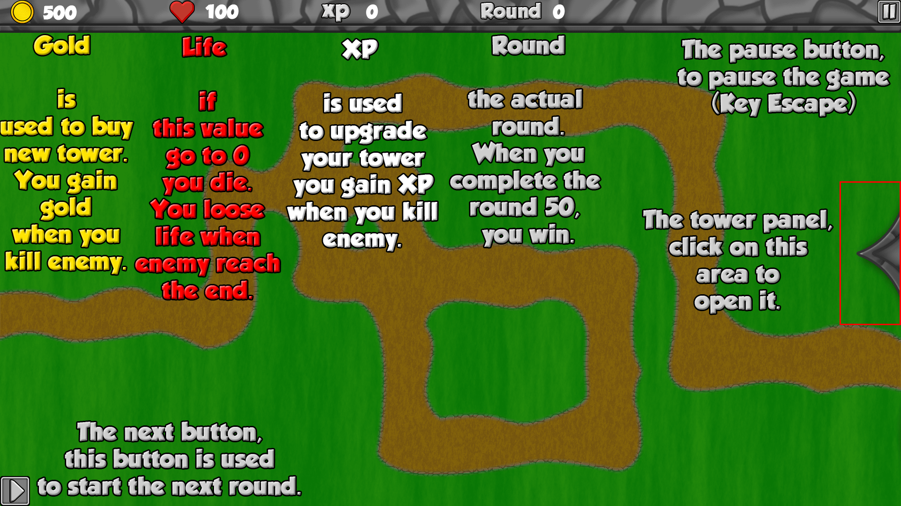
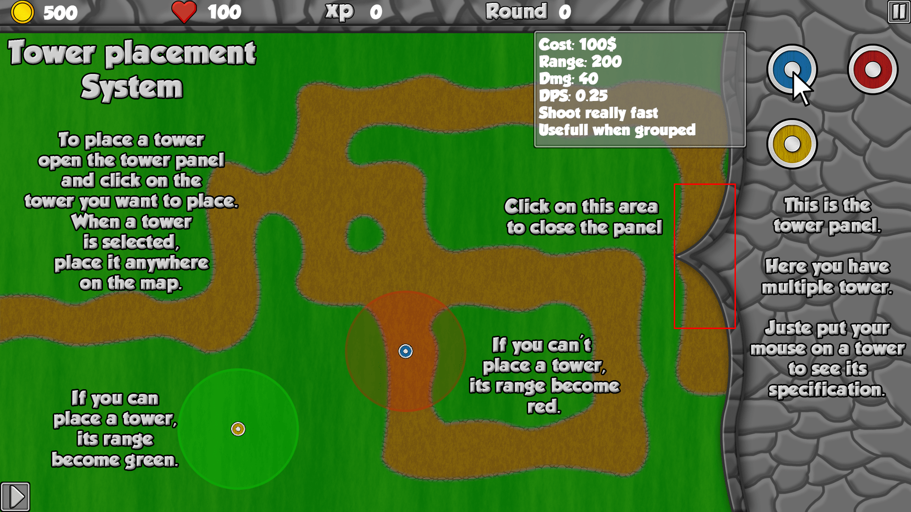
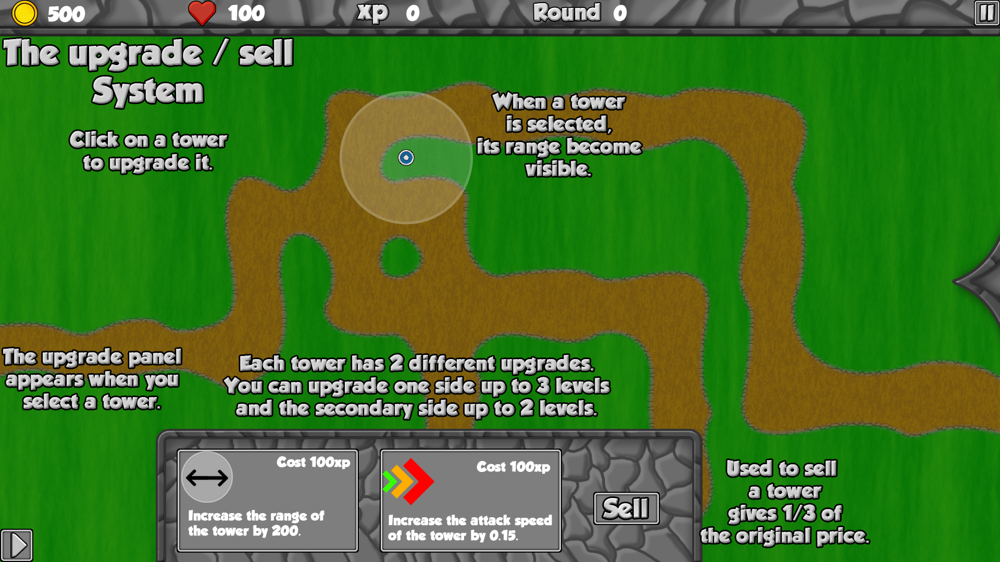
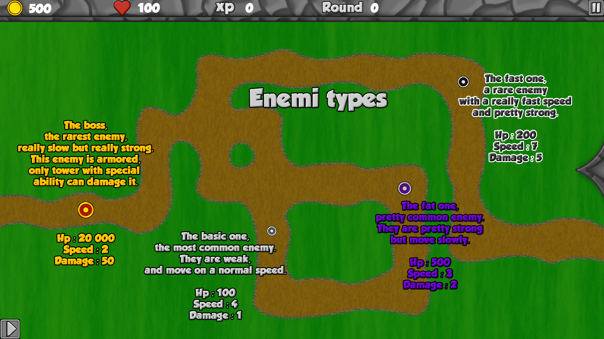

# My_Defender
This is a school projet created with @Hrothgor, this project is a tower basic defense created with the CSFML library.

## Goal
The goal of the game is to survive 50 waves of monster, for this you have dfferent tower with different ability an power to protect youself from monster.

## How to build (Linux Only)
Clone this repo anywhere and open a new command prompt inside the main folder and type ***make***. 
Once the build is done in the command prompt type ***./my_defender*** or ***bash my_defender*** 

## How to play
This how to play instruction are alsqo avaible in game.

Main information

Tower placement system

Tower configuration

Enemi types

## Special credits
Song used **[Two Steps From Hell - Bravestone](https://www.youtube.com/watch?v=AK85JgT5e0Q)**
